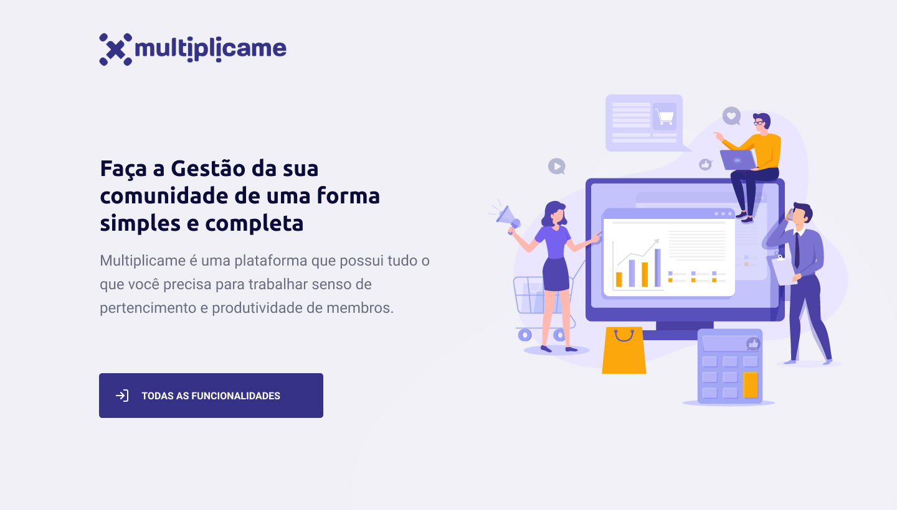

# community-management 


## Instalar o projeto
Instalar o projeto com:
```sh 
yarn

```
ou
```sh 
npm i
```


### Rodar o projeto
Para rodar o projeto, podemos utilizar o comando:
```sh
yarn start
```
Com ele o projeto e o servidor serão executados automaticamente, sendo o projeto na porta 8080 e o servidor na porta 3000.


### Tecnologias usadas
Esse projeto foi desenvolvido com as seguintes tecnologias:
- [Vue]
- [Quasar]
- [Axios]
- [Css]
- [Json-Server]
  


### Licença

Esse projeto está sob a licença MIT. Veja o arquivo [LICENSE](LICENSE.md) para mais detalhes.

### 📱 Social

Me acompanhe nas minhas redes sociais.

<p align="center">

   <a href="https://github.com/lucca-rodrigues" target="_blank" >
    </a> 
  
  <a href="https://www.instagram.com/_luccaoficial/" target="_blank" >
    </a> 
  
  <a href="https://www.facebook.com/luccarodriguesgtr" target="_blank" >
    </a> 

  <a href="https://www.linkedin.com/in/lucas-rodrigues-66a2b07a/" target="_blank" >
    </a> 
  
  <a href="mailto:contato.luccarodrigues@gmail.com" target="_blank" >
    </a> 
  
  <a href="https://api.whatsapp.com/send?phone=554198938062" target="_blank" >
    </a>
</p>

---

Feito com ❤️ by **Lucca Rodrigues** 🤙
